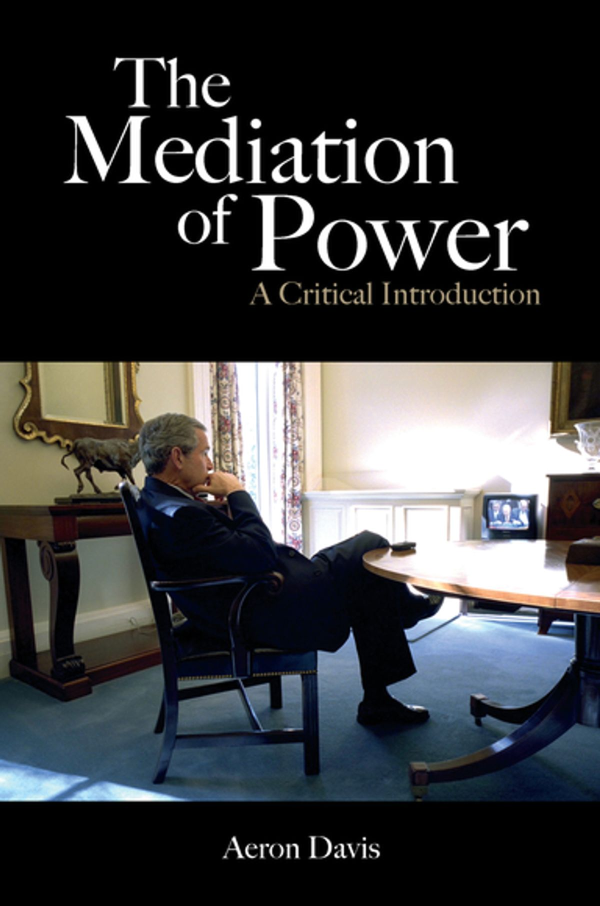

There aren’t that many book that change how you think about the world. But one that had a big impact on me while I was researching my PhD was Aeron Davis’s *The Mediation of Power*. Like me, Aeron started researching media and communication but pivoted into the sociology of elites. In this work on elites he draws on semi-structured interviews, including with MPs and the CEOs and chairs of large companies.

In a subsequent book, *Reckless Opportunists*, Aeron draws on his extensive interview data to argue that neoliberalism has produced an acquisitive, individualistic and short-termism ruling class with little sense of its own collective interests, let alone any sense of noblesse oblige (hence the book’s subtitle: *Elites at the End of the Establishment*). The ideal type is made flesh in the mercenary and unscrupulous figure of Boris Johnson who adorns the book’s front cover, haplessly dangling from a zip wire with a union flag in each hand.

{style="float: right; width: 35%; margin-left: 1em;"}

*The Mediation of Power* argued for a break with the classic paradigm in critical media sociology developed in the 20th century, which sees the media as a set of institutions inculcating capitalist ideology among mass audiences. Instead, it proposes what Aeron called an ‘inverted political economy’ approach. Rather than assuming a downward transmission of capitalist ideology from elites to the masses, we should focus instead on the role of media and communication within elite networks.

An important precursor to this argument is found in *The Dominant Ideology Thesis*, which is kind of a classic in British sociology. That book pointed out that empirically we find little evidence of adherence to a ‘dominant ideology’ amongst the public broadly, but notes that the one place it is more evident is amongst the dominant classes themselves.

The implication of this is that as researchers we should focus more the ideas and practices of the powerful than the ideology of the dominated classes, who anyway possess relatively little agency. There’s a degree of political pessimism here, and for what it’s worth I think it goes too far in departing from the ideological role of the media. But it’s an important corrective and needless to say I’m very much in agreement about the need to research the powerful.

I was reminded of *The Mediation of Power* when I saw an article reporting survey-based research on the media consumption habits of members of parliament. Thought it would be interesting to compare these findings to equivalent data on media use amongst the public. To be honest, it wasn’t *that* interesting. But thought it was worth posting anyway. In the graph below I plot the percentage of MPs who regularly use particular online news outlets on the Y axis and the percentage of the public who use those same outlets on the X axis. The dotted red line is where we’d expect the data points if MPs and the public had exactly the same media consumption habits. So, any outlet above that line is proportionally more used by MPs, and anything below is more used by the public. The data on MPs is from a [report](https://www.5654.co.uk/our-perspective/influence-and-information-the-media-habits-of-westminster-2026) published by the corporate affairs consultancy 5654 & Company, and the data on the X axis is from Ofcom’s 2025 *News Consumption in the UK* [report](https://www.ofcom.org.uk/siteassets/resources/documents/research-and-data/online-research/adult-and-teen-news-consumption-survey/news-consumption-in-the-uk-2025-research-findings.pdf?v=400636). Obviously, the graph only includes outlets featuring in both sources, and I should note that the two datasets are not strictly speaking directly comparable. Have a look at the sources for details on the methods if you like.

<iframe src="fig.html" width="100%" height="700" style="border:none;">

</iframe>

As I said, not that interesting or surprising. MPs are of course more engaged with the news media in general, and they tend to use outlets geared towards more affluent and educated audiences. I think we can see three types of outlets here: those with ‘mass audiences’ – *The Express*, *Sun* and *Mail* – which sit below the red dotted line; the ‘elite’ publications at the very top: the *FT*, *The Times* and the *Guardian*; and the middling outlets sitting just above the line, which if you account for the higher media use amongst MPs generally, appear to have a fairly balanced profile.

The two digital platforms included muddy the waters somewhat because MPs are using these to communicate, as well as to consume news. But I think we can confidently say that they are as a group very online, and I’d add that when they are they are very much in elite echo chambers (not something that seems to have concerned policy makers and analysts very much).

Lots of problems and limitations here. Really what you want is a regression model that can estimate media consumption taking into account the demographic profile of MPs. Do they differ when controlling for their educational and class profile? All we get from 5654 & Company is descriptive stats on their media use as a group, with separate breakdowns for groups of MPs. Needless to say, the motivation for collecting this data is not to advance the public understanding of political power, but to inform the influence operations of potential clients. The researchers are themselves very much involved in ‘the mediation of power’.

Then there’s the fact that MPs as a group are formed through a very unusual process. The electoral system is partisan and undemocratic. That’s why the *Guardian* features so prominently here. There are now lots of Labour MPs, and they differ markedly from their right-wing counterparts when it comes to their media use, as the breakdowns in the report show. Presumably in the last Parliament the graph would have looked very different.

For a meaningful understanding of the culture of the House of Commons, really we want to know about the broader population from which MPs are drawn – the world of Westminster with its coterie of unelected political operatives, consultants and lobbyists – and how far that group differs from the public when it comes to their ideas and priorities. You’d probably need qualitative methods like those Aeron has used to examine that world. But with the right data and methods you could probably produce something interesting from survey data. Or find nothing much of interest. Which would also be revealing.