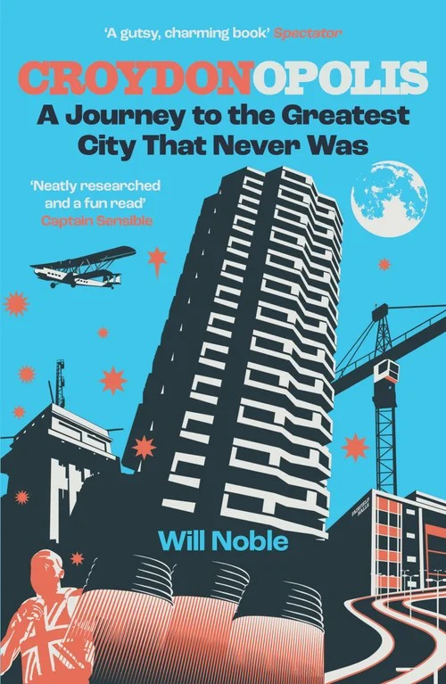
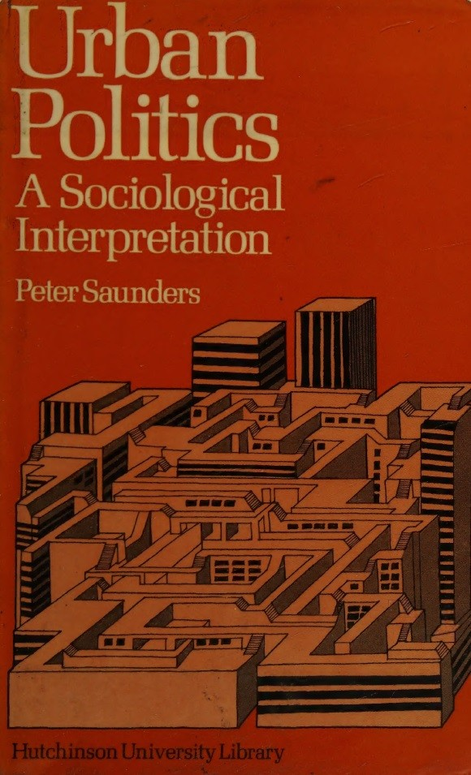

Can I just shock you? I like Croydon. Have to admit I've been down on the place in the past. Perhaps not for good reasons, but at least for understandable reasons. It's not the prettiest of places. Like Birmingham it also feels like it's built more for cars than pedestrians, and I don't drive these days. That said, its probably not a great place for car enthusiasts either. Sure there are plenty of roads and car parks. But I have driven in and through it a fair number of times (mainly on Ikea trips) and its not an experience I would particularly recommend. It can feel chaotic and inhospitable however you navigate it. When I'm feeling down on the place I'd say it combines the worst of inner and outer London. But - and fell free to disagree with me here - Croydon is *interesting*.

{style="float: right;  margin-left: 1em;" width="100%"}

A while back I saw a video by some London TikToker who went on a day trip to Nottingham and had a revelation: 'Nottingham is the sibling of Croydon!' This amused me because I've always felt the whole vibe of Croydon is more Midlands town than London neighbourhood. For a while I'd convinced myself that Croydon must have had a similar sort of historical political economy as Derby or Nottingham. Maybe it was a former market town transformed by the textiles industry before later being absorbed into London? It wasn't, but I wasn't far off. 

It's not just the trams, which obviously invite comparison with Nottingham. It's the architecture and general feel of the place. The smattering of older buildings, hinting at a pre-20th century heritage, amidst the concrete flyover, the duel carriageways, the underpasses, walkways and high rise office buildings, the conspicuous poverty and abandoned buildings and building sites. You get these in most of England, but there's a critical mass at which point the combination defines a place.

{style="float: right; margin-left: 1em;" width="263"}

For all that, I think there's lots to recommend Croydon. It's not nearly as grim or as rough as everyone says, and its got a lot going for it if you know where to look. There's some great food shops and restaurants, some good pubs (albeit not as many as most London neighbourhoods), and there's loads of things to do, if you can get to them. Its diverse, lively, has a genuine 'community' feel to it in places, and is, I now think, more gritty than grim. It's also not nearly as annoying as most other parts of London. It's of course very much the underdog, which always appeals to me.

Let's just say, I've developed a fondness for the place of late. And recently I indulged this by picking up a copy of Will Noble's book, *Croydonopolis: A Journey to the Greatest City That Never Was*. It's an entertaining, easy read, which - *Spectator* endorsement notwithstanding - I would recommend to anyone who's an out and out Croydon enthusiast, or just Croydon-curious. There's lots of short chapters on different aspects and historical episodes, but the chapters I found most interesting are on Croydon's post war development boom. Here's an extract:

> *Croydon... did a more comprehensive job denuding itself of its heritage and accompanying culture than almost anywhere else... For every Corinthian House and NLA Tower there was a fistful of blunt, lifeless boxes... One resident of the upwardly expanding town during the 1970s and 80s was Judge Dredd co-creator Carlos Ezquerra, and there's little doubt that the sparring towers and swirling motorways of Croydon goaded on his vision of Mega-City One, a dystopian metropolis in which his eponymous hero races around stubbing out vice and criminality (Noble 2024, 172, 178)*

I'm not a huge fan of brutalism. I love some of the iconic buildings. I've read my Owen Hatherley and am sympathetic to the political arguments. But I still struggle with the aesthetic of hum drum concrete developments. The conventional take from your Telegraph-types is that the brutalist blight in post war Britain was a misguided project of leftwing utopians. But what happened in Croydon, it seems, was something quite different. On Noble's telling (or my take on his telling really), the much lamented 'Croydonisation' was the product of an unholy alliance of rapacious property developers and unaccountable bureaucrats who were driven not by paternalistic municipal socialism and rationalist town planning, but by the spirit of capitalism, which was then in its modernist phase of creative destruction. The figure at the heart of it all was the Penge-born Tory, Sir James Marshall, who for years dominated Croydon Council and chaired the Whitgift Foundation, which remains a major land owner in the borough. '[His] name is not memorialised by any major Croydon buildings, roads or parks,' Noble writes. 'But, to quote the inscription on the grave of Christopher Wren, if you seek his monument, look around.' (Noble, 2024: 172, 182)

Committed as I am to 'grasp\[ing\] history and biography and the relations between the two within society', to quote C. Wright Mills, I went down a bit of a rabbit hole trying to make sense of the life and legacy of Sir James. This led me, via [this post](https://wellesleyroad.github.io/why.html), to a highly cited 1979 sociological study I'd never read, but really should have, entitled, *Urban Politics: A Sociological Perspective* (Saunders, 1979).

It's author, Croydon boy Peter Saunders, is that rarest of things: a right-wing sociologist. He seems to have always been in the Weberian empiricist camp of British sociology, which, if it has one, is the discipline's rightwing. I have a lot more time for these guys than they do for others. At best, they produce some excellent and thought provoking social science. At worst they are haughty and petulant. Saunders seems to have parted ways with academic sociology in the 1990s when researching the relationship between IQ and occupational outcomes, becoming instead a conservative public intellectual, first in Australia and then in his native UK. I first became aware of him as the author of a critique of *The Spirit Level* published by the right-wing think tank Policy Exchange.

{style="float: right; margin-left: 1em;" width="263"}

*Urban Politics* was Saunders's PhD project and it is an impressive piece of work combining a detailed case study of Croydon's urban politics with theoretical engagement and methodological and philosophical reflections. All the big (male) names are there: Marx, Engels, Weber of course, Althusser, Poulantzas, Ralph Miliband, David Harvey, C. Wright Mills, Floyd Hunter, Robert Dahl, Howard Becker. The list goes on. The heart of the book, four empirical chapters, draw on unstructured interviews with 'potentially powerful' people holding key positions in Croydon. Saunders initially hoped to carry out a quantitative study using structured questions, but soon realised that he wouldn't be able to capture the dynamics of social power in Croydon with classic methods that rely on a dataset of individuals with particular attributes, since such an attribute 'can\[not\] be decontextualized from the social relationships in which it is embedded.' (Saunders, 1979: 337) Recognising that 'power is a quality of social relationships' he concluded that it couldn't be captured quantitiveley (before launching into a long discussion around the consequences of his qualitative method for the scientific validity of his study). Saunders could of course have used network analysis to formally model the social relationships, but he doesn't seem to be aware of the method.

What Saunders ended up doing, basically, was speaking to everyone in Croydon who might on the face of it be powerful, and through these conversations trying to make sense of the local power structure. I don't know if you'd consider a detailed study of a London borough 'studying up', but it's very much in the same spirit, just at the local level. Saunders notes at one point discussing his method:

> *It is somewhat simpler to infiltrate a working men’s club than it is to gain entry to the Masonic Lodge, and the difficulties of conducting participant-observation on the factory floor are likely to pale into insignificance when the sociologist moves into the boardroom. (Saunders, 1979: 326)*

It's the only detailed UK study I know of a local power structure in the tradition of Floyd Hunter's classic study of New Haven (Hunter, 1953), though I have probably overlooked more recent studies in other disciplines like geography and perhaps political science (let me know if you know). In terms of the findings, it confirms what I'd learned from Noble, namely that Sir James Marshall played a 'pivotal role' in shaping modern Croydon:

> *Sir James reigned supreme in Croydon, a political Gulliver in the Lilliputian land of local government, and that the way in which the redevelopment was accomplished was directly attributable to him. (Saunders, 1979: 307)*

Yet whilst acknowledging his importance, Saunders's doesn't focus much on Marshall as a figure. What he does very effectively is detail the local power networks within which Marshall, during his long reign, was the central node, 'a relatively dense and cohesive network of business and political activists, interacting regularly and relatively informally in a variety of institutional contexts' (Saunders 1979, 313). Saunders shows that business interests dominated decision making in Croydon at that time. Although the actual personnel on the Council were drawn from smaller businesses, rather than the big companies that set up head offices in the centre of Croydon during this period, the latter regularly interacted with the local players:

> *We have already seen that, although Croydon council is to a large extent run by businessmen, the town centre business interests — the large retailers and the various national and multi-national companies are not generally represented in its membership. This does not mean that they are politically inactive, however, for what is immediately apparent when one begins to analyse the membership of a wide variety of boards, committees and quasi-political organizations in the town is that, far from being ‘too big to piss around with local politics’, the senior management levels of these companies are intimately engaged in the administrative and political life of the town.*

> *In virtually every case, the organizations in which town centre businessmen become involved are those in which local authority members and officers are also to be found. The list of such bodies is extensive, and it includes the Chamber of Commerce, the Technical College board of governors, the council’s Youth Employment subcommittee (which includes coopted members from business, the trades unions and the teaching profession), hospital management committees, the local magistrates bench, the National Savings committee and the governing committee of the National Savings Bank, the Rotary Club and other social, professional and sporting clubs, the Whitgift Foundation governing body and the managing committees of other less prominent local charities, the Bishop of Croydon’s Industrial Chaplaincy, and so on. In all of these cases, to a greater or lesser extent representatives of town centre businesses regularly rub shoulders with some of the most politically powerful individuals in the borough.*

> *\[...\]*

> *Included in the membership of Croydon Chamber of Commerce local are a number of local councillors with business interests in the town, and notably the chairman of the Highways committee (a local estate agent and director of a property company) and the chairman of the Plans subcommittee (managing director and chairman of a large builders’ merchants and director of a property development company). (Saunders, 1979: 309-311)*

One thing that was satisfying for me reading this study is that I've always suspected that the sort of power structures we see at the national level are replicated at the local level too, and we see this very clearly in 1970s Croydon. Even in a small English village I suspect you'll find significant class inequalities and a *petty ruling class* connected through banal networks - the parish council, the Freemasons, school boards, local business associations, and so on.

An interesting question Saunders discusses is whether there is any tension between the local *petty bourgeoisie* and the representatives of large companies whose initiatives in the town centre potentially threatened the former's interests. He argues essentially that whilst there are some potential tensions over particular policies, big business and small business owners have enough shared interests to ensure unity, and that the local political regime effectively represented business as a whole.

> *In their clubs, committees and boards, as well as in their more formal consultative meetings, the various representatives of Croydon’s business community interact regularly with political leaders who generally believe what they believe, think what they think, and want what they want. No pressure group, no matter how well-organized or how well-connected, enjoys a relationship like this, for in such a fertile context, opinions, suggestions and modes of thought pass almost imperceptibly, like osmosis, from businessmen to politicians, and from politicians to businessmen. (Saunders, 1979: 324)*

Three interesting points. The first is that Saunders's study was carried out at a time when the UK's social democracy was under strain, but still very much institutionally intact. The UK was at this point the most equal it had ever been, and has been to date. Yet even in this period it's very clear that capitalist interests dominated political decision making, at least in Croydon (there would of course be very interesting developments soon at the Greater London Council). Second, we see in the networks Saunders details a politically cohesive alliance of the *petty bourgeoisie* and big business. This alliance was the bedrock of the emerging Thatcherite project, but likely preceded its political expression. Third, if I haven't been able to convince you that Croydon is good, actually, hopefully I've convinced you that if you think its post-war architecture made it ugly and dysfunctional, this is a legacy of capitalist interests, not hubristic socialist planning.

### References

Hunter, F. (1953). *Community Power Structure: A Study of Decision Makers*. Chapel Hill: UNC Press.

Noble, W. (2024) *Croydonopolis: A Journey to the Greatest City That Never Was*. London: Safe Haven Books. 

Saunders, P. (1979) *Urban Politics: A Sociological Interpretation*. London: Hutchinson.