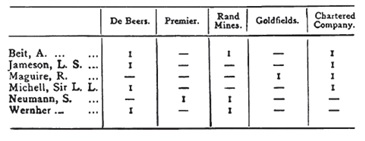

In this post I revisit pioneering work by the American Marxist economist Paul Sweezy in which he examined a network of the largest US companies in 1935, identifying eight distinct ‘interest groups’ based on common control. I compare Sweezy's groups to the results of a consensus-based community detection algorithm.

### Introducing Paul Sweezy

{style="float: right; width: 35%; margin-left: 1em;"}

Something of a class traitor, Paul Sweezy (1910-2004) was born to a wealthy New York family and attended the American equivalent of a British public school. After graduating from Harvard, he became interested in economics and crossed the pond to study at the London School of Economics.

Initially Sweezy was attracted by the presence there of Friedrich Hayek, but with the Great Depression wreaking havoc around the world, Marxism appealed to him more than liberal economics. Alongside Hayek, the Marx-curious Labour intellectual Harold Laski then taught at LSE under the watchful eye of the UK security state. Laski is said to have influenced Sweezy, who also came within the orbit of the Keynesian economists of the Cambridge school, including Joan Robinson. Apparently now a convert to Marxism, Sweezy returned to Harvard to complete his PhD, during which time he became close to the conservative economist Joseph Schumpeter.

In 1949, armed with the confidence of a ruling class and socialist education, Sweezy founded the Marxist journal [*Monthly Review*](https://monthlyreview.org/), the first issue of which included Albert Eistein’s famous essay, ['Why Socialism?'](https://monthlyreview.org/articles/why-socialism/). Norman Finkelstein has a post on his blog, ['Misadventures in the Class Struggle'](https://www.normanfinkelstein.com/finkelstein-misadventures-in-the-class-struggle/), in which he recalls ‘hang\[ing\] around the *Monthly Review* office for the first copy off the press of each new issue’. He remembers Sweezy as ‘the gentlest and most decent of souls’ who ‘later became a generous mentor as well as supporter’. He also notes that Sweezy wrote a ‘gushing obituary’ of Stalin on his death, describing him as ‘one of the greatest men of all time’.

Sweezy is probably best known as the co-author with Paul Baran of *Monopoly Capital*, and for his earlier single authored book, *The Theory of Capitalist Development*. But whilst mostly remembered for his works in political economy, Sweezy was a pioneering scholar of the US ruling class. His writings influenced two sociologists in particular who have inspired me: Bill Domhoff and John Scott, both of whom produced influential studies of the power elite/ruling class in the US and UK respectively. A year before co-founded *Monthly Review*, Sweezy undertook some research examining what he called ‘corporate interest groupings’, which we'll revisit in this post.

### Written out of intellectual history

Sweezy has an important place in the pre-history of power structure research and, though largely unacknowledged, corporate network analysis. But he’s not even mentioned in Linton Freeman’s *The Development of Social Network Analysis*. That book’s very brief discussion of corporate networks instead focuses on earlier efforts by the British journalist and political economist J.A. Hobson. To be fair, Hobson is himself an important and interesting character. Maybe I’ll come back to him another day. He combined investigative research and biographical sketches (often peppered with casual antisemitism) with political economy and geopolitics. Though a liberal, his forceful and sophisticated critiques of imperialism would influence Lenin and Hilferding’s writings on imperialism and finance capital.

{style="float: right; margin-left: 1em;" width="100%"}

Freeman credits Hobson with being ‘the first investigator to collect systematic data on corporate interlocks’ (Freeman, 2004: 19) in work analysing the network of firms and financiers that controlled banks, land, mines, railways, newspapers and telegraph companies in colonial South Africa. He sees Hobson’s major contribution as having collected ‘two mode data’, meaning two types of entities each of which is connected exclusively to the other type, in this case directors and companies. Hobson produced a table, reproduced by Freeman, showing individuals whose multiple board appointments connected five major companies he referred to as the ‘small inner ring of South African finance.’ (Freeman, 2004: 18)

."){style="float: right;  margin-left: 1em;" width="40%"}

Hobson is also the main focus in a section on ‘Interlocking directorships and corporate power’ in John Scott’s *What is Social Network Analysis?*, with Sweezy getting a passing mention. For Scott, Hobson’s most significant innovation was to represent corporate control diagrammatically. Not sure if the diagram on the right is the one Scott is referring to, but it’s the only one I could find online. According to Scott, Hobson’s innovation would inspire the 1912-13 US congressional subcommittee known as the Pujo Committee, which investigated the network of control (‘money trust’) established by the major investment banks in the US and produced the first ‘maps of corporate power’ (Scott, 2013: 77). Below is one such map, available [online](https://catalog.archives.gov/id/138930942) via the US National Archives. It shows J.P. Morgan and Co. at the centre of the network.

{width="100%"}

### *The Structure of the American Economy*

Two decades later, another congressional committee would produce another influential report called *The Structure of the American Economy*, with the support of a group of academic economists - among them our *enfant terrible* of the dismal science. Gardiner Means (of Berle and Means fame) headed the group of researchers, the members of which produced a series of statistical appendixes to the main report. These identified the largest 200 non-financial companies and largest 50 financial companies and in the United States in 1935. One of these appendices detailed ‘Interlocking Directorates Among the Largest American Corporations’. This is credited to a researcher called Eleonor Poland, who worked for Means and seems to have been even more comprehensively written out of the history of corporate networks research than Sweezy.

The nation-wide network of companies the research team identified included large commercial banks, and manufacturing, railway and telecommunications companies. It had first emerged in the late 19th and early 20th century through a series of mergers intended to reduce economic competition, which was undermining profits, and afford greater legal protection against populist and socialist critics who had attacked the existing practice of secretive agreements between businesses outlawed by anti-trust legislation (Domhoff, 2022: 40-42).

The data from this research team has been used in a number of studies of corporate networks in the US, including my own with Bill Domhoff (Mills and Domhoff, 2023). Sweezy’s contribution, entitled ‘Appendix 13: Interest Groupings in the American Economy’, was later republished in *The Present as History* along with a number of other interesting essays (Sweezy, 1953). In it, Sweezy examines the connections between the largest US companies arising from shared (‘interlocking’) directors, attempting to identify coherent ‘interest groups’ among the largest firms.

### Sweezy's method

Explaining how he approached this task, Sweezy suggests that in general ‘companies ought to be grouped together if… they have a significant element of control in common.’ (Sweezy, 1953: 161) He reasoned that interlocking directorships alone could not be used to determine the boundaries of an interest group since this would bring ‘all but a few of the 200 largest nonfinancial corporations into a single interest group’. The methods and terminology hadn’t been developed at that stage, but here what Sweezy is saying is that if we construct a network from interlocking directors then the majority of companies would likely form one large interest group (what we would now call the ‘largest component’ of a network) – as in fact they do.

Trying to untangle this network and identify coherent interest groups within it, Sweezy proposed that we should think in terms of primary and secondary ‘interlocks’. The idea here is that a stronger tie should be thought of as existing between pairs of companies in the event that one of the two represented ‘the main business interest’ of the interlocking director. If the same director links two companies that are more peripheral to the director’s business interests, that for Sweezy should give rise only to a ‘secondary interlock’ that should be ‘interpreted with caution’. (Sweezy, 1953: 162) He also suggests that ‘multiple interlocks should be given more weight than single interlocks’ (Sweezy, 1953: 163). This can now easily be done by weighting the edges between nodes.

Examining the ties between the 250 largest companies – which must have been maddeningly complex task without being able to construct and visualise a formal network/graph – Sweezy writes that ‘there gradually emerged eight more or less clearly defined groups which so far overshadowed all the others’ (Sweezy, 1953: 167). The groups Sweezy identifies, in the order they are discussed, were: the (1) Morgan-First National interest group (which includes the First National Bank of New York, where Sweezy's father worked), (2) Rockefeller, (3) Kohn, Loeb, (4) Mellon, (5) Chicago, (6) Du Pont, (7) Cleveland, and (8) Boston.

When I started work on a comparative study of US corporate networks in the 1930s and 2010s with Bill Domhoff a few years back (Mills and Domhoff, 2023), one thing I did fairly early on was to examine whether there were meaningful subgroups of companies within what we called the ‘corporate community’. The 1930s intercorporate network was much denser than its 2010s equivalent, but it also seemed to have clearer subgroups within it. The data we used was ultimately derived from the congressional research team of which Sweezy was a member. So when Bill mentioned Sweezy’s study to me, I thought it would be interesting to compare the interest groups Sweezy had identified with the results I got identifying ‘communities’ within our network. As with a lot of poking around that goes on in research projects, this was interesting, but it didn’t find its way into the published article.

Sweezy thought identifying interest groups would inevitably be a qualitative method, writing: ‘No statistical technique has been or is likely to be devised for reducing them to a quantitative scale.’ (Sweezy, 1953: 159) In fact, as network analysis developed over the course of the 20th century, numerous methods for identifying groups of nodes within a component with denser ties between them have been developed. This group of methods is referred to as ‘community detection’.

### Comparison with contemporary methods

Community detection algorithms all seem to work along broadly similar lines. They partition your network into subgroups and then compare the density of ties within the subgroups to the density in a random network with the same number of nodes and edges. In other words, you ‘shuffle’ the connections in your network and that becomes the benchmark for comparing the actual distribution of edges within a subset of nodes. The metric this produces is referred to as *modularity*, and it is used by these algorithms to try and find the best division of a network into subgroups/communities/clusters.

These algorithms can work from the ‘top down’, removing edges that are most important for holding the network together, creating smaller and smaller subgroups, or ‘bottom up’ by merging adjacent nodes and creating larger and larger subgroups. The modularity score is used to determine whether to further increase or decrease the subgroups, the aim being to iteratively find the best possible division.

The problem with these algorithms, though, is that due to the complexity of even relatively small networks, they are inevitably non-deterministic. So if you re-run an algorithm, you get slightly different divisions each time. To address this problem, researchers have used ‘consensus clustering’. You run the algorithm multiple times and the most consistent division returned is then used. Kuppevelt et al (2022) have developed a method that not only provides a consensus clustering, but also a node-level measure indicating how consistently a given node appears in a community. The script is freely available on GitHub [here](https://github.com/research-Dafne/consistency-paper). I ran this script for our 1930s intercorporate network and then compared the communities it identified with those Sweezy had discovered. I show the results in the Sankey diagram below. On the left are Sweezy's interest groups and on the right are the arbitrarily numbered communities identified by the algorithm.

<iframe src="sankey_embed.html" width="100%" height="800" style="border:none;">

</iframe>

A few points. First, I ran the ‘consensus clustering’ on the ‘largest component’ of the network of 250 corporations identified by the aforementioned congressional committee. Initially, I had assumed that this would be the same company set that Sweezy was working from. But in fact there are a number of companies in his ‘interest groups’ that don’t appear in the data. This puzzled me at the time, and it was only when returning to the sources for this post that I realised Sweezy was working from a provisional list of companies, not the final published list I was working from. Second, obviously our methods for identifying interest groups are different, but in a sense our data is different too in a second sense. As I mentioned earlier, Sweezy refers to ‘primary’ and ‘secondary’ interlocks. This distinction isn’t something I can easily reproduce. The ties in my network are weighted according to the proportion of individuals that any company in fact, and potentially could, share with another company. But the edges in the underlying bipartite network (that is the original network containing companies and directors) are all equal. Unlike Sweezy I don’t know whether the ‘main business interests’ of a director producing an edge between a pair of companies (his ‘primary’ and ‘secondary’ ties), so I’m not able to reflect this using some kind of (admittedly arbitrary) weighting. Finally, although his method isn’t completely clear, Sweezy seems to have taken ownership into account, and that’s again not something I have in the data I’m working with. So I think its worth pointing out that the results of the ‘consistency clustering’ shown on right of the diagram isn’t necessarily a better division than the groupings Sweezy identified shown on the left, even if the method is more scientific, insofar as it is systematic and reproducible.

You can explore the difference yourself by hovering over the diagram, but it should be immediately clear that at least four of the corporate interest groups Sweezy identified have clear counterparts in the consistency clustering partition. But as we move down the diagram, Sweezy’s groups start to look more doubtful.

The Rockefeller group doesn’t seem to have the cohesive character that Sweezy suggested. It’s spilt between several communities. The Kohn-Loeb group is similar. A chunk of these firms forms a community with the majority of Rockefeller companies and one firm from Sweezy's Morgan-First National group.

The Morgan-First National group in the consistency clustering comprises of two large blocks, one which contains both the banks at the heart of the group – J.P. Morgan & Co. and First National Bank New York – and forms a community with all the companies Sweezy classified in his separate Du Pont group, and another which forms a separate group alongside one company from Sweezy’s Kohn-Loeb group. The connection between the Morgan-First National and Du Point groupings is actually mentioned by Sweezy in a section noting various connections between his different interest groups. There he notes the presence of directors from the Morgan-First National group on the board of General Motors (Sweezy, 1953: 185). His other notes on connections between the interest groups, though don’t seem to correspond to the divisions we get from the consistency clustering.

So some significant differences, and it’s impossible to tell if they reflect the strength or the weaknesses of his qualitative approach, or small differences based on the provisional company set he was working from. But I think it’s fair to say Sweezy did a pretty good job given that none of the formal methods for identifying such groups had yet been developed.

### References

Domhoff, G.W. (2022) *Who Rules America? The Corporate Rich, White Nationalist Republicans, and Inclusionary Democrats in the 2020s*. New York and London: Routledge.

Freeman, L.C. (2004). *The Development of Social Network Analysis: A Study in the Sociology of Science*. Empirical Press.

Hobson, J. A., (1905) ‘The Structure of South African Finance’, *Speaker*, 12(291) (29 April), 117–118.

Kuppevelt, D. E. V., Bakhshi, R., Heemskerk, E. M., & Takes, F. W. (2022). Community membership consistency applied to corporate board interlock networks. *Journal of Computational Social Science*, 5(1), 841-860.

Mills, T., & Domhoff, G. W. (2023). The policy-planning capacity of the American corporate community: corporations, policy-oriented nonprofits, and the inner circle in 1935–1936 and 2010–2011. *Theory and Society*, 52(6), 1067-1096.

Scott, J. (2013). *What is Social Network Analysis,* Third Edition. Sage Publications.

Sweezy, P. M. (1953) ‘Interest groups in the American economy’, in P. M. Sweezy (ed.) *The Present as History: Essays and Reviews on Capitalism and Socialism*, New York: Monthly Review Press.